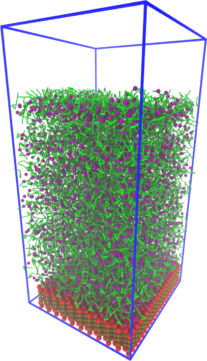

# THEMOSIA Winter School 2026  
## Coarse-Grained Modeling of Solid–Ionic Liquid Interfaces

This repository contains the **hands-on course material** for the **THEMOSIA Winter School 2026**, focused on coarse-grained (CG) molecular modeling of **solid–ionic liquid interfaces** using the **Martini 3 force field**.

The course combines **lectures** and **hands-on tutorials**, guiding participants through the construction, simulation, and analysis of CG models for interfaces involving **silica, graphene, and imidazolium-based ionic liquids**.

---

## Course Information

- **Event:** THEMOSIA Winter School 2026
- **Location:** room M7.1H04 in CBPsmn at ENS de Lyon (Monod site), Lyon, France
- **Dates:** January 19–23, 2026
  
- **Coarse-grained Module:** January 22–23, 2026
     
- **Instructor:**  
  - Dr. Paulo Cesar Telles de Souza (ENS de Lyon, CNRS, France)

The coarse-grained module follows introductory molecular dynamics lectures earlier in the week.

---

## Course Scope and Objectives
<table>
  <tr>
    <td width="70%">

The main objective of this course is to provide participants with **practical experience** in coarse-grained molecular simulations of interfaces.

Topics covered include:

- Fundamental principles of **coarse-graining**
- Overview and philosophy of the **Martini 3 force field**
- Modeling **solid surfaces** (as silica and graphene) in CG simulations
- Coarse-grained representations of **imidazolium-based ionic liquids**
- Construction of **solid–ionic liquid interfaces**
- Running CG molecular dynamics simulations
- Analysis of **interfacial structure and dynamics**
- Interpretation and limitations of CG results

The emphasis is on **model construction, physical insight, and critical interpretation**, rather than force-field development.
    </td>
    <td width="30%">
      
    </td>
  </tr>
</table>

---

## [Hands-on Sessions Overview](hands_on/)

The hands-on material is organized into a sequence of tutorials located in the `hands_on/` directory.

### - Hands-on 01 – Building Solid surfaces

### - Hands-on 02 – Building Solid–Ionic Liquid Interfaces

### - Hands-on 03 – Running CG Molecular Dynamics and Analysis 

---

## Repository Organization

```
themosia2026-cg-interfaces/
│ 
├── docs/               
│   ├── lectures/               # Course documentation
│   └── papers/                 # Paper to be consulted during the school
│ 
├── hands_on/
│   ├── 00_templates/           # Models, scripts, and template
│   ├── 01_build_slabs/         # Building solid surfaces 
│   ├── 02_build_interface/     # Solid–ionic liquid interfaces
│   └── 03_run_MD_and_analysis/ # Running CG MD (GROMACS / OpenMM)
│ 
└── README.md
```

Participants are expected to **build their own systems** during the tutorials.

The `00_templates/` directory contains reference scripts and models that should be **copied or linked**, not modified directly.

---

## Key References

Participants are encouraged to consult the following references:

- Souza, P.C.T. et al. [Martini 3: a general purpose force field for coarse-grained molecular dynamics](https://doi.org/10.1038/s41592-021-01098-3). Nature Methods 18, 382-388 (2021). 

- Marrink, et al. [Two decades of Martini: Better beads, broader scope](https://doi.org/10.1002/wcms.1620) WIREs Computational Molecular Science, 13(1):e1620.(2023).

- Vazquez-Salazar, L.I. et al. [Martini coarse-grained models of imidazolium-based ionic liquids: from nanostructural organization to liquid–liquid extraction](https://doi.org/10.1039/D0GC01823F).  Green Chemistry , 22, 7376-7386 (2020).

- Shrestha, R. et al. [Martini 3 Coarse-Grained Models for Carbon Nanomaterials](https://doi.org/10.1021/acs.jctc.5c00923) J. Chem. Theory Comput. 2025, 21, 18, 9035–9053 (2025).

- Cambiaso, S. et al. [Solid–liquid interfaces in MARTINI 3: Modeling approaches and the case study of silica surfaces in water](https://doi.org/10.1016/j.surfin.2025.106997) Surfaces and Interfaces, 72, 106997 (2025).

---


## Notes for Participants

- These materials are intended **for educational purposes**
- Coarse-grained models have **known limitations**
- Results should be interpreted with care.
- If you use these workflows or models in research, please **cite the original authors and force-field developers**

---

## Acknowledgements

This course material was prepared for the **THEMOSIA Winter School 2026** and builds upon contributions from the Martini community and the molecular simulation community at large.
