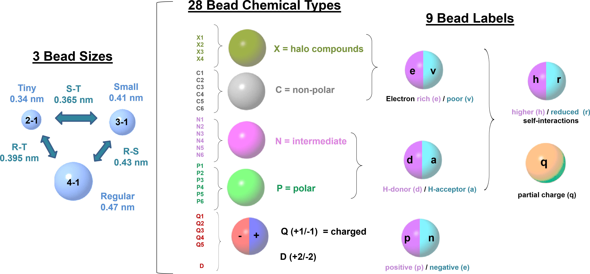
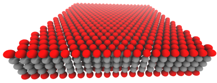
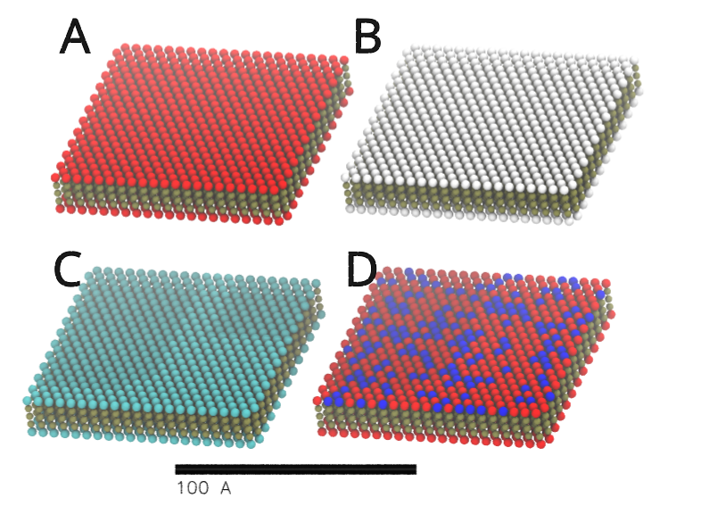

# Hands-on 01 — Building Solid Surfaces

## 1. Objective

In this hands-on session you will build a **Martini 3 coarse-grained (CG) silica slab** that will later be used to assemble **solid–ionic liquid interfaces**. The material is based on the work of  [Cambiaso et al Surf. Interfaces. (2025)](https://doi.org/10.1016/j.surfin.2025.106997).

By the end of this hands-on you should be able to:

- Generate a CG silica slab with a defined size and thickness.
- Create a surface model with **different bead types in the core and at the surface**.
- Control basic “surface properties” that influence interfacial behavior:
  - **bead type** (surface chemistry)
  - **bead spacing / surface density** (structure)
  - **surface charge** 
- Produce the files needed for the next hands-ons (coordinates + topology).

---

## 2. Background: CG surfaces in Martini

In coarse-grained simulations, a solid surface can be represented as a **mesoscopic model**, meaning an intermediate description between full atomistic and continuum representations that captures collective interfacial behavior rather than explicit atomic detail. The goal is to reproduce key macroscopic or emergent properties (e.g., wetting, solvent layering, adsorption), not to maintain a one-to-one mapping between individual atoms and coarse-grained beads.

In this framework, the CG silica slab is not constructed by mapping every silicon and oxygen atom to corresponding beads. Instead, the surface is built from effective interaction sites that represent groups of atoms or generic surface features, with interaction parameters chosen to reproduce the desired interfacial behavior. As a result, the model is **phenomenological rather than chemically exact**.

When building the CG silica slabs, we can consider two possible simulation box geometries: **orthorhombic** and **hexagonal (triclinic)**. These choices correspond to different modeling intentions. Hexagonal (triclinic) boxes are the natural choice if one aims to represent a true crystalline α-quartz surface. Such a geometry would be appropriate if the goal were to model a specific quartz crystal face with atomistic fidelity. Orthorhombic boxes, on the other hand, are primarily a **computational convenience**. A triangular lattice can be embedded in an orthorhombic supercell without altering the local bead arrangement or surface bead density. In this case, the box shape does not represent a real crystal symmetry; it simply provides a rectangular container for the coarse-grained surface.

In this context, the term *crystalline* refers to the **local bead arrangement and bead density** used to construct the slab, and **not** to long-range crystallographic symmetry as in atomistic models. Indeed, Cambiaso et al. Surf. Interfaces. (2025) used orthorhombic boxes regardless of whether the surface was described as crystalline or amorphous. The focus of that work — and of the present hands-on — is on reproducing macroscopic interfacial properties through the correct surface bead density, rather than on preserving crystallographic symmetry or atom-to-bead mapping.

This means that several choices are **part of the model definition**, not “details”:

- **Surface bead density**, defined by the spacing between beads.
- **Surface bead properties**, which define the effective surface chemistry (and possibly surface charge).
- **Surface rigidity**, i.e. whether the surface is treated as rigid, restrained, or flexible.

These choices can strongly affect interfacial structure and dynamics, and they are expected to be tested and justified depending on the target application.

In this course, we will focus on three practical modeling parameters that you can tune and immediately interpret:

1. **Surface bead type (chemistry)**
   - We assign different bead types to the **surface** and the **core** to represent different effective interactions with the ionic liquid liquid (following the modeling logic used for silica surfaces in the reference work). 

2. **Bead spacing / surface density (structure)**
   - The distance between surface beads controls the effective roughness and interaction density seen by the ionic liquid, which can change layering and organization near the interface. 

Once the solid–ionic liquid systems are assembled (later hands-ons), we will quantify surface-induced effects using:

- **partial density profiles** along the surface normal (layering, enrichment/depletion)
- optional: RDFs, diffusion, and orientational order parameters can also be considered.

For now, the goal is to build a clean, reproducible silica slab model with controllable parameters.

---

## 3. Building a silica slab

### 3.1 Overview of the slab model

The slab model used in this tutorial has the following features:

- **Crystalline lattice**  
  Beads are arranged in stacked triangular layers along the surface normal (*z*).

- **Core vs surface beads**  
  - **Core beads** represent the bulk of the solid and provide mechanical stability.
  - **Surface beads** (top and bottom layers) define the effective surface chemistry experienced by the ionic liquid.

- **Bonded solid network**  
  Beads within a cutoff distance are connected by harmonic bonds, forming a mechanically stable solid.

- **Slab-safe periodicity**  
  Bonds are constructed considering periodic boundary conditions **only in the x–y directions**, avoiding unphysical bonded connections across the vacuum gap along *z*.

---

### 3.2 Generating the slab using the builder script

In this hands-on, we generate a **reference silica slab** that closely follows the original model used in Cambiaso et al Surf. Interfaces. (2025). Copy build_silica_slab.py from 00_templates/. You can first run

```bash
python3 build_silica_slab.py -h
```
To see the options of the code avaiable. But to start with an eansy example, let's run:

```bash
python3 build_silica_slab.py \
  -type crystalline \
  -x 10.0 -y 10.0 -z 2.0 \
  -core N2 \
  -surface N5 \
  -bonds -ef 10000 -rcut 0.65 \
  -pbc_bonds xy \
  -pr 10000 \
  -o silica
```

**Key options explained:**

- `-x 10.0 -y 10.0 -z 2.0 `  
  Gives the dimensions of the box in nm. Considering a 10 × 10 × 2 nm silica slab, this setup produces 2520 beads distributed over 5 planes. If one loosely associates each bead with a silicon-centered unit, this corresponds to roughly 7560 non-hydrogen atoms, i.e. an effective mapping of about three non-hydrogen atoms per bead (roughly SiO₂). However, this correspondence should not be interpreted as a strict atom-to-bead mapping: in this model, beads represent effective interaction sites chosen to reproduce macroscopic interfacial behavior, rather than chemically explicit Si and O atoms.

- `-core N2` / `-surface N5`  
  Assign different Martini bead types to the slab interior and the surface to represent effective surface chemistry. In the Martini model, bead types encode effective polarity and solvent affinity, rather than explicit chemical groups. Martini 3 organizes beads into broad chemical classes, such as C (apolar), N (intermediately polar), and P (polar), spanning a continuous range of interaction strengths More details are avaiable here [Marrink, et al. WIREs Comput Mol Sci (2023)](https://doi.org/10.1002/wcms.1620). For silica surfaces, N5 beads can be used to represent highly hydrophilic environments, corresponding to surfaces rich in hydroxyl (–OH) groups at the atomistic level, while N2 beads represent less polar, more weakly interacting silica environments and are therefore considered a reasonable choice for the slab core.

  <p align="center">
  
  </p>

<p align="center">
<em>**Figure 1**: Bead options in Martini 3.</em>
</p>

- `-bonds -ef 10000 -rcut 0.65`  
  Create a stiff bonded network between neighboring beads (within 6.5 Å), ensuring that the slab behaves as a solid. In principle, the force constant could be tuned to reproduce specific mechanical properties of the material. Here, however, it is used simply to keep the surface reasonably rigid and numerically stable under the chosen simulation conditions

- `-pbc_bonds xy`  
  Apply periodic bonding only in the lateral directions, which is safe for slab geometries.

- `-pr 10000`  
  Add **position restraints** to all slab beads (10 000 kJ mol⁻¹ nm⁻²).  
  These restraints are intended **only for energy minimization and equilibration** and are activated by defining `POSRES` in the GROMACS `.mdp` file. Alternatively, you could use position restraints along the production simulations, but without the adding a bonded network.

---

### 3.3 Output files

The builder produces three files:

- **silica.gro**  
  GROMACS coordinate file (units: nm)

- **silica.pdb**  
  Coordinate file in Å, useful for visualization in VMD.

- **silica.itp**  
  Topology file defining bead types, bonds, masses, charges, and optional position restraints

You can see a representation of this first silica slab in Figure 2. These files will be reused in later hands-ons to assemble solid–ionic liquid systems.

<p align="center">
  

<em>**Figure 2**: Silica slab model, with core represented by gray beads (N2 type) while the surface by red ones (N5 type).</em>
</p>

## 4. Modifying surface parameters

Now that you have learned the basics of how the builder works, you can generate **controlled variations of surface properties**. 
The examples below illustrate simple and physically motivated modifications that can be explored systematically.

---

### 4.1 Surface bead type (effective chemistry)

A first and intuitive modification is to change the **surface bead type**, which controls the effective chemistry experienced by the liquid.

#### Example: hydrophobized silica surface

Experimentally, silica surfaces are often hydrophobized by trimethylsilylation, replacing surface silanol groups with –Si(CH₃)₃ moieties. By inspecting the Supporting Information of the Martini 3 paper ([Souza et al., Nat. Methods (2025)](https://doi.org/10.1038/s41592-021-01098-3); in particular Supplementary Table 24), one can consider that, at the coarse-grained level, this modification can be mimicked by assigning a **nonpolar C bead type* to the surface, such as C2. This can be achieved by adding the corresponding flag to the builder:

```bash
-surface C2
```

This represents a hydrophobic surface and is expected to impact the interactions with the ionic liquids.

---

### 4.2 Bead spacing and surface density

Bead spacing controls the **effective surface density and roughness** experienced by the liquid at the interface.

By default, the bead spacing used in the silica slab builder corresponds to the values employed by Cambiaso et al. Surf. Interfaces. (2025), which were shown to reproduce macroscopic interfacial properties such as wetting behavior.

An alternative modeling choice is to construct a surface whose bead spacing reflects typical **Si–Si distances** in crystalline silica. This can be compared directly with the crystal structures used in the atomistic MD hands-on from the previous day. A representative estimate for this spacing is approximately **0.292 nm**.

The bead spacing can be modified using the `-a` flag in the slab builder:

```bash
-a 0.292
```

When reducing the bead spacing, it is recommended to also adjust the bonding cutoff to avoid creating an excessively connected network. For example, the cutoff distance can be reduced to -rcut 0.53

From a coarse-graining perspective, changing the bead spacing can also be related to changing the effective mapping resolution of the surface. In Martini 3, different bead sizes (tiny, small, regular) are associated with different levels of resolution, roughly corresponding to 2-to-1, 3-to-1, and 4-to-1 mappings, respectively. For silica, a 3-to-1–like resolution could alternatively be explored by using small neutral beads, for example via -core SN2 and -surface SN5. While this choice may yield more accurate solvent–surface distances, for the phenomenological approach adopted here for silica it is not expected to lead to a substantial gain in accuracy, and would mainly increase the computational cost.

---

### 4.3 Surface charge and functionalization

Surface charge is introduced in an **effective, coarse-grained manner**, representing the average charge state of surface functional groups.

#### Example: amino-functionalized silica surface

Assuming pH ≈ pKₐ and partial protonation of amine groups, a reasonable CG approximation is to assign a **partial positive charge** to surface beads.

To represent roughly **50% protonation**, use:

```bash
-top N4dq -qtop +0.5
```

This creates a **partially charged surface**, , sufficient to induce electrostatic ordering of the ionic liquid without assuming full protonation. Here, the "q" label is part of the Martini 3 model definition and modifies the bead interactions accordingly, rather than serving as a purely descriptive tag.

---

### 4.4 Partial and heterogeneous surface modification

Real silica surfaces are rarely perfectly homogeneous.  
To mimic **partial functionalization or mixed surface chemistry**, the builder allows random modification of **only a fraction of surface beads**.

You can define:
- a second bead type on the surface
- the fraction of beads to modify
- optionally, a different charge for the modified beads

If the fraction is not specified, the code defaults to an **equal (50/50) distribution**.

#### Example: 30% amino-functionalized patches on the top surface

```bash
-top2 Q4p -qtop2 +1.0 -ftop2 0.30
```

This produces a surface where 30% of top-layer beads are randomly functionalized, while the remainder retain the original surface chemistry. Here, Q-type beads are used to represent monovalent charged groups or ions in Martini 3, providing a coarse-grained way to introduce localized, fully charged surface sites.

This option is useful for exploring:
- heterogeneous functionalization
- imperfect or patchy surface treatments
- sensitivity of interfacial structure to surface disorder

<p align="center">
  

<em>**Figure 3**: Representation of some of silica slab models discussed in this hands-on: (A) default silica slab (N5 type in the surface, red), (B) hydrophobized silica surface (C2 type in the surface, white), (C) amino-functionalized silica surface (N4dq bead with 0.5 partial charge, cyan), (D) 30% amino-functionalized patches on the top surface (Q4p with +1.0 charge).
  </em>
</p>

---

## 4.5 Notes and modeling perspective

The default silica slab and the surface modifications introduced here are **model definitions**, not fine-tuning parameters.

They should be chosen based on:
- the physical question being addressed
- consistency with the chosen level of coarse-graining
- systematic comparison across variants

The silica models presented here are best viewed as **toy models**: they sacrifice chemical detail in favor of simplicity, transparency, and tunability.

The strength of the CG approach lies in its ability to **identify qualitative trends**, not to reproduce atomic-scale structure. In particular, they are mesoscopic surface models, designed to reproduce interfacial behavior rather than to preserve a direct atom-to-bead mapping or crystallographic fidelity.

## 5. A note on graphite surfaces (based on the Martini 3 graphene model)

In addition to silica, we will also use **graphitic surfaces** as an alternative solid substrate. In this course, graphite is modeled using the **Martini 3 graphene model**, which represents an infinite, periodic graphene sheet and can be used as an effective model for graphitic surfaces. In contrast to the silica slabs discussed above, the graphene model is explicitly structure-driven and based on a well-defined atomistic-to-coarse-grained mapping.

The graphene model employed here follows the Martini 3 parametrization developed by [Shrestha et al. JCTC (2025)](https://doi.org/10.1016/j.surfin.2025.106997), which can reproduces resonable well some structural, elastic, and adsorption trends of graphene within the Martini framework. The model uses a hexagonal lattice of tiny (T) beads and is designed to be used as a **rigid, periodic surface**, making it well suited for interfacial simulations. The model has well-defined mapping rules and should even be able to reproduce overall packing of graphite and even π-stacking distances.

<p align="center">
  
</p>

<p align="center">
<em>**Figure 4**: Graphene atomistic structure, mappin and CG model. Real particles are shown in black while red ones indicate virtual sites, typically used to increase numerical stability in Martini modes.</em>
</p>

In contrast to silica, **no parameter exploration is consider for graphite** in this course. The goal is simply to generate a surface of comparable lateral size to the silica slab, which can then be used in solid–ionic liquid interface simulations.

---

### 5.1 Building a periodic graphene sheet

Periodic graphene sheets are generated using `martini3-graphene-periodic.py` (available at  
https://github.com/MoMS-MMSB/Martini3-Graphene). A copy of the script is also provided in `00_templates/`.

A typical command to generate a periodic graphene sheet is:

```bash
python3 martini3-graphene-periodic.py \
  -x 10 \
  -y 10 \
  -o graphene
```

After generation, inspect the box dimensions written in the last line of the generated `.gro` file:

```bash
tail -n 1 graphene.gro
```

The reported *x* and *y* values will be reused when redefining the box height.

---

### 5.2 Defining the interlayer spacing

The graphene builder ensures correct lateral periodicity (*x* and *y*), but the box height (*z*) must be defined manually before stacking layers.

In the Martini 3 graphene model, carbon atoms are represented by **Tiny beads** with a Lennard–Jones size parameter of approximately  
\(\sigma \approx 0.34\) nm. For a standard Lennard–Jones 12–6 potential, the minimum of the interaction potential occurs at:

\[
r_\text{min} = 2^{1/6}\sigma \approx 0.382\ \text{nm}
\]

We use this value as an effective **interlayer spacing** when constructing a graphitic slab.

Redefine the box height using the *x* and *y* values obtained from `tail -n 1`:

```bash
gmx editconf -f graphene.gro -box X Y 0.382 -o graphene_1layer.gro
```

where `X` and `Y` are taken directly from the last line of `graphene.gro`.

---

### 5.3 Stacking graphene layers to obtain graphite

A graphitic slab is constructed by stacking multiple graphene layers along the *z* direction. In this course, we use **five layers**, which is sufficient to represent a graphite substrate at the coarse-grained level.

```bash
gmx genconf -f graphene_1layer.gro -o graphite.gro -nbox 1 1 5
```

This produces a five-layer graphite slab with a total thickness of  
\(5 \times 0.382 \approx 1.9\) nm.


