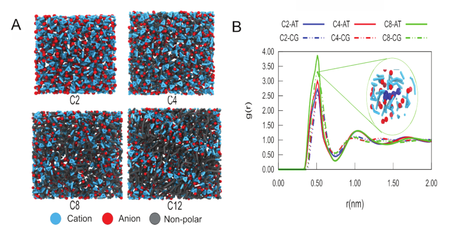
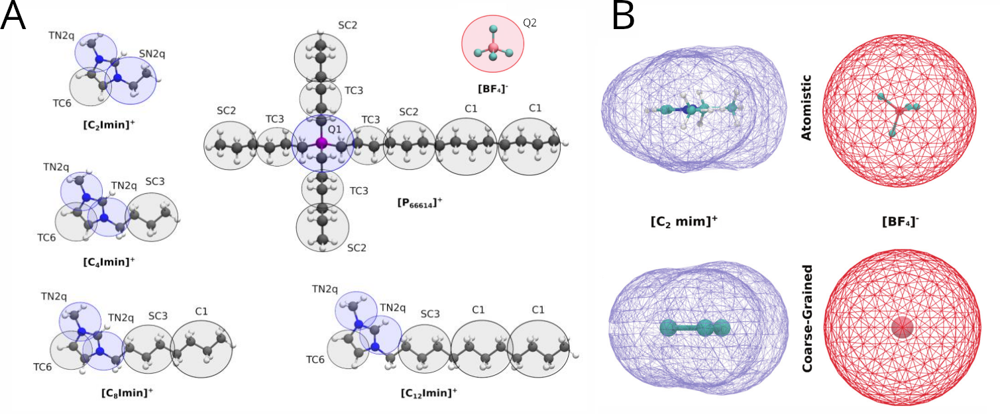

# Hands-on 02 — Building Solid–Ionic Liquid Interfaces

## Objective

In this hands-on, we build **solid–ionic liquid interfaces** using coarse-grained (CG) models within the Martini 3 framework. Starting from the solid surfaces constructed in Hands-on 01 (silica or graphite), we add Martini 3 models of imidazolium-based ionic liquids and prepare systems suitable for molecular dynamics simulations.

The goal is to investigate **how solid surfaces influence the organization of ionic liquids**, focusing on interfacial layering, density profiles, and structural ordering.

---

## Background and modeling choices


The coarse-grained models of ionic liquids used in this hands-on are based on the Martini 3 models developed and validated by [Vazquez-Salazar et al. Green Chem., 2020](https://doi.org/10.1039/D0GC01823F). This model was later updated, with a new version released with the major publication of Martini 3 force-field, [P.C.T. et al.Nature Methods 2021](https://doi.org/10.1038/s41592-021-01098-3).These models describe a family of **imidazolium-based ionic liquids** of the form **[C<sub>n</sub>mim][BF<sub>4</sub>]**, where **C<sub>n</sub>mim<sup>+</sup>** denotes the *1-alkyl-3-methylimidazolium* cation with an alkyl chain of length *n* (with *n* = 2, 4, or 8 in this course), and **BF<sub>4</sub><sup>−</sup>** is the *tetrafluoroborate* anion.

These coarse-grained models reproduce key bulk properties of imidazolium-based ionic liquids, including density, nanostructural heterogeneity, and chain-length-dependent ordering (Figure 1). In this course, we exploit these validated bulk properties to investigate how solid surfaces further perturb ionic-liquid organization at solid–ionic liquid interfaces.

  <p align="center">
  
  </p>

<p align="center">
<em><strong>Figure 1</strong>: Structural characterization  of Martini 3 CG models of ionic liquids. The model reasinably reproduce experimental macroscopic phases(A)  and some features of local structural observed in atomics models (B). Figure is adapted from Vazquez-Salazar et al. Green Chem., 2020. </em>
</p>

### Ionic liquids considered

We focus on **imidazolium-based ionic liquids** paired with the **BF<sub>4</sub><sup>−</sup>** anion, using two representative alkyl chain lengths on the cation:

- [C<sub>2</sub>mim][BF<sub>4</sub>]: 1-ethyl-3-methylimidazolium tetrafluoroborate  
- [C<sub>8</sub>mim][BF<sub>4</sub>]: 1-octyl-3-methylimidazolium tetrafluoroborate  

These two systems span increasing degrees of **nanostructural heterogeneity** in the bulk ionic liquid, while **not forming lamellar phases under the conditions considered**. Lamellar ordering typically emerges only for longer alkyl chains (e.g. [C<sub>12</sub>mim][BF<sub>4</sub>]).

This makes [C<sub>2</sub>mim][BF<sub>4</sub>] and [C<sub>8</sub>mim][BF<sub>4</sub>] ideal model systems to explore whether **solid surfaces can induce additional ordering or layering** in ionic liquids that is absent in the bulk.

As a bonus (if time allows), the `00_templates/` directory also includes coarse-grained models for **[C<sub>4</sub>mim][BF<sub>4</sub>] and [C<sub>12</sub>mim][BF<sub>4</sub>] imidazolium-based ionic liquids**, as well as a **phosphonium-based cations**(specifically trihexyltetradecylphosphonium), which can be explored for comparison or extended studies.


### Coarse-grained ionic liquid model

The coarse-grained ionic liquid models used here were built based on the following key features:

- Careful **mapping and bonded geometry choices** to reproduce molecular volume, solvent-accessible surface area (SASA), and packing behavior.
- Coupled with the previous point, careful parametrization of the bonded terms was also considered in order to reproduce distributions of bond distances, angles, and dihedrals obtained from atomistic simulations, such as those discussed in the previous days of this school.
- Compatibility with the Martini 3 interaction matrix, respecting the expected bead assignments according to the chemistry being represented.
- Use of **partial charges (q labels)** to represent charge delocalization on the imidazolium ring. The values of the charges in the imidazolium ring (+0.5 on each nitrogen-based bead) were computed according to a variant of the Dipole Preserving Charge method, based on quantum chemical calculations similar to those discussed on the first day of this school. This allowed for an improved electrostatic description, including possible quadrupolar effects. In this sense, simple dipole and quadrupole estimates can be used to help define an appropriate set of partial charges for the beads representing the imidazolium ions.

<p align="center">
  
</p>

<p align="center">
<em><strong>Figure 2</strong>: Martini 3 CG models of ionic liquids. (A) CG models of trihexyltetradecylphosphonium and 1,3-dialkylimidazolium
cations, as well as tetrafluoroborate anions. The Martini bead types and sizes are indicated. Blue indicates positively charged groups, while red and gray indicate negatively charged and nonpolar groups, respectively. (B) Molecular surfaces (also called Connolly surfaces) of atomistic and CG structures of the [C<sub>2</sub>mim][BF<sub>4</sub>] cation and the [BF<sub>4</sub>]<sup>−</sup> anion. Figure adapted from Vazquez-Salazar et al., Green Chem. (2020) and Souza et al., Nat. Methods (2021).</em>
</p>

As the focus of this hands-on is **not coarse-grained parametrization**, but rather **interfacial organization**, we will not extend this discussion further. Extensive examples of parametrization strategies are available in the tutorials provided by the Martini Force Field Initiative website.

---

## Interface construction strategy

To keep the setup robust and reproducible, we adopt the following strategy:

- The **solid slab** (silica or graphite) is kept fixed during construction.
- Ionic liquids are inserted **above the surface** using **PACKMOL**.
- **Ion pairs (cation + anion)** are used during packing to guarantee charge neutrality and avoid possible numerical instabilities.
- The simulation geometry is kept **identical for all systems**, enabling direct comparison.

### Fixed geometry for all systems

- Solid slab: 10 × 10 × 2 nm  
- Ionic liquid region: 15 nm  
- Vacuum region: 3 nm  
- Total box height: 20 nm  
- Periodic boundary conditions in x and y  

---

## Step 1 — Extract surface dimensions

Before building the interface, extract the lateral box dimensions from the surface file generated in Hands-on 01:

```bash
tail -n 1 silica.gro
```

The x and y values will be reused to define the interface box, ensuring perfect lateral matching between the surface and the ionic liquid. This is particularly important for simulations of rigid solids, especially when bonded terms connect the extremes of the solid through periodic boundary conditions. This avoids numerical instabilities, but requires the x–y box size to be defined precisely.

---

## Step 2 — PACKMOL input: slab + ionic liquid + vacuum

PACKMOL is used to place the ionic liquid above the surface while leaving a vacuum region empty.

Because Martini beads are larger and softer than atomistic particles, we use a **larger tolerance** than in typical atomistic setups. One practical strategy is to include cations and anions as **ion pairs**, which can help avoid excessive repulsion between highly charged groups placed too close to each other by PACKMOL. Below is an example for the [C<sub>2</sub>mim][BF<sub>4</sub>] ionic liquid.

### Example PACKMOL input: [C<sub>2</sub>mim][BF<sub>4</sub>] ionic liquid using ion pairs

```text
tolerance 2.8
filetype pdb
output silica_IL_vacuum.pdb
seed 12345

structure silica.pdb
  fixed 0.0 0.0 0.0   0.0 0.0 0.0
end structure

structure C2-BF4.pdb
  number 5000
  inside box 0.0 0.0 23.0   100.1700 99.1426 170.0
end structure
```

Notes:

- The slab occupies approximately z = 0–20 Å.
- The ionic liquid starts slightly above the surface (z = 23 Å) to avoid overlaps.
- Charge neutrality is guaranteed by packing **ion pairs**, but if you want to add extra ions for charged slabs, you can also use PDB files containing single ions (e.g. `BF4.pdb`).

Before running PACKMOL, be sure to copy the required PDB files from `00_templates/`. Then run:

```bash
packmol < input.inp
```

---

## Step 3 — Define the final simulation box

In this step, a vacuum region is included in the simulation box. One convenient procedure is to convert the PACKMOL PDB output to a GROMACS `.gro` file and define the final box dimensions:

```bash
gmx editconf -f silica_IL_vacuum.pdb -o box.gro -box 10.01700 9.91426 20.00000 -noc
```

The `-noc` flag prevents GROMACS from recentering the components in the large box. While not strictly required for the simulations, it is convenient for visualization.

Be sure to use the same x and y values matching those extracted from the surface file.

---

## Step 4 — Reorder atoms for GROMACS topology

Since PACKMOL places ion pairs together, the coordinate file should be reordered to simplify topology handling. For GROMACS, reorder the `.gro` file so that atoms appear in the following order:

1. Silica slab  
2. Cations  
3. Anions  

For the example shown here, the residue names are:

- Silica: `1SI`  
- Cation: `1EIM`  
- Anion: `2BF4`  

Check the contents of the ion-pair PDB files in `00_templates/` to adapt this script for other cations.

### Reordering procedure

```bash
title=$(head -n 1 box.gro)
box=$(tail -n 1 box.gro)

tail -n +3 box.gro | head -n -1 > atoms_only.tmp

{
  grep "^[[:space:]]*1SI" atoms_only.tmp
  grep "^[[:space:]]*1EIM" atoms_only.tmp
  grep "^[[:space:]]*2BF4" atoms_only.tmp
} > atoms_reordered.tmp

natoms=$(wc -l < atoms_reordered.tmp)

{
  echo "$title"
  printf "%5d\n" "$natoms"
  cat atoms_reordered.tmp
  echo "$box"
} > start.gro

rm atoms_only.tmp atoms_reordered.tmp
```

---

## Step 5 — Topology file

With the simulation box ready, a topology file must be created. An example is shown below:

```text
#include "martini_v3.0.itp"
#include "cation_C2imin.itp"
#include "anion.itp"
#include "silica.itp"

[ system ]
Interface silica C2imin-BF4

[ molecules ]
SILICA_SLAB 1
EIM   4000
BF4   4000
```

Notes:

- `.itp` files in GROMACS contain force-field parameters. `martini_v3.0.itp` defines bead types and nonbonded interactions, while molecule-specific `.itp` files define bead assignments, charges, and bonded terms.
- The `[ molecules ]` section must match both the **names** and the **order** of components in the `.gro` coordinate file.

---

## Final remarks and discussion points

- The number of ion pairs is chosen to give a **reasonable filling** of the ionic liquid region. At the coarse-grained level, this is a modeling choice rather than a strict physical constraint.
- The same protocol applies to [C<sub>8</sub>mim][BF<sub>4</sub>] or other ionic liquids, but the number of ion pairs must be adjusted. Larger cations occupy more space; as a rough guideline, [C<sub>2</sub>mim][BF<sub>4</sub>] works well with ~5000 ion pairs, while ~3500 is reasonable for [C<sub>8</sub>mim][BF<sub>4</sub>].

### Questions for discussion

- How would this protocol need to be adapted for **charged silica surfaces**?
- What changes (if any) are required when replacing silica with **graphite**?
