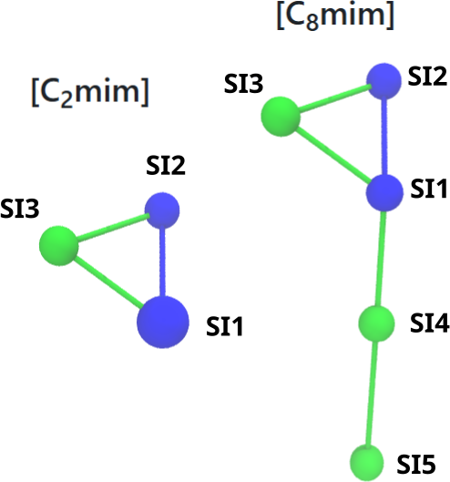
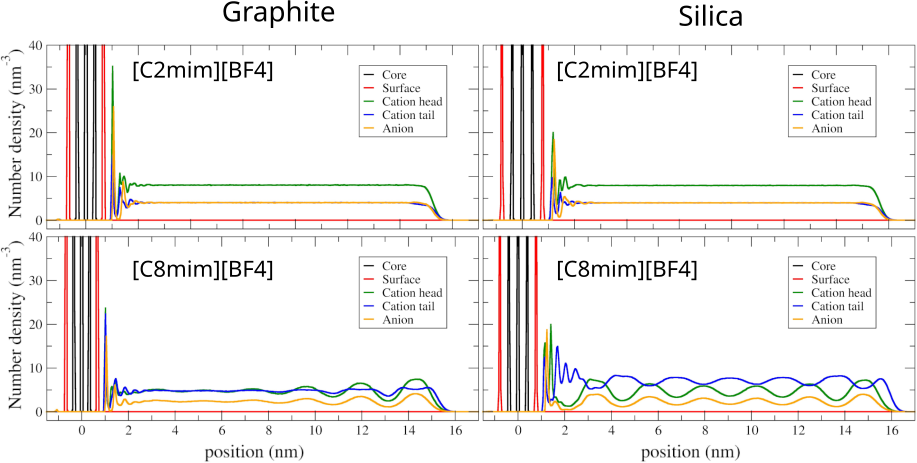

# Hands-on 03 — Running CG Molecular Dynamics and Analysis

## Objective

In this hands-on, we run short coarse-grained (Martini 3) molecular dynamics simulations of the **solid–ionic liquid interfaces** built in Hands-on 02 and perform the **minimum analysis** needed to assess interfacial organization.

The central question is:

**Do silica or graphite surfaces induce additional ordering in imidazolium-based ionic liquids like [C<sub>2</sub>mim][BF<sub>4</sub>] or [C<sub>8</sub>mim][BF<sub>4</sub>])?**

---

## Simulation protocol with GROMACS

GROMACS is a popular open-source software package used for molecular dynamics (MD) simulations.   It is especially well known for studying biomolecular systems (proteins, lipids, membranes), but it is also widely used in soft matter and materials simulations, including **solid–liquid interfaces**. GROMACS is valued for being highly efficient on both CPUs and GPUs, and for providing many built-in tools for trajectory analysis.

We use a simple and consistent protocol for all systems here:

1. **Energy minimization**
2. **Short equilibration** (NVT, 10 fs time step)
3. **Production run** (NVT, 20 fs time step)

Because the interface setup includes a **vacuum region along z**, we use **NVT simulations throughout**.

Position restraints are applied to the solid during minimization and equilibration (silica; and also graphite when applicable).

> **Note on the connection to the atomistic hands-on:**  
> In the atomistic hands-on, simulations were run using **OpenMM** (Python-based workflows).  
> Here, we switch to **GROMACS**, which uses a command-line workflow based on `.mdp` parameter files and the `gmx grompp` → `gmx mdrun` sequence.

### Practical notes (Martini + interfaces)

- All the parameters selected for the MD simulations are defined in the GROMACS `.mdp` files. You can find examples in the `00_templates/` directory. Additional information is available [here](https://manual.gromacs.org/current/user-guide/mdp-options.html).
- Martini models typically allow **larger time steps** than atomistic MD (10–20 fs is common). This is one of the reasons why CG models are faster than atomistic ones.
- The **Berendsen thermostat** is used only for equilibration. It is typically more robust during the initial relaxation of the system.
- The **v-rescale thermostat** is used for production to ensure correct ensemble sampling of the velocity distribution.
- Periodic boundary conditions are applied in **x and y**.
- The vacuum region along **z** prevents interactions with the periodic image on the other side of the slab, which can otherwise over-induce ordering of the liquid.

---


## Running the simulations

With all the files ready from the previous hands on, now is time to run the simulations. For that, you need to copy the mdp files the min.mdp, eq.mdp and md.mdp from the  `00_templates/` directory.


**Note on common options:**
- `-nt` sets the number of CPU threads used by `mdrun`.
- `-deffnm` sets the default filename prefix for all output files (e.g., `traj_comp.xtc`, `md.edr`, `md.log`).


### 1) Energy minimization

```bash
gmx grompp -f min.mdp -p topol.top -c start.gro -o min.tpr -maxwarn 1 -r start.gro
gmx mdrun  -nt 8 -v -deffnm min
```

### 2) Equilibration (NVT, 10 fs, Berendsen thermostat)

```bash
gmx grompp -f eq.mdp -p topol.top -c min.gro -o eq.tpr -maxwarn 1 -r start.gro
gmx mdrun  -nt 8 -v -deffnm eq
```

### 3) Production (NVT, 20 fs, v-rescale thermostat)

```bash
gmx grompp -f md.mdp -p topol.top -c eq.gro -o md.tpr -maxwarn 1
gmx mdrun  -nt 8 -v -deffnm md
```

---

## Quick sanity checks (recommended)

These checks are fast and help confirm the setup is correct before analysis:

- **After minimization:** no obvious instabilities (energies are finite, structure looks reasonable).
- **After equilibration:** the ionic liquid remains in contact with the surface (no drifting into vacuum).
  - For both steps, the code gmx energy -f file_name.edr can be used to see how properties like temperature and potential energy are evolving with time.
- **During production:** the trajectory runs without crashes and the interface remains stable.

A simple visual inspection in VMD of `eq.gro` + `traj_comp.xtc` is usually sufficient. 

```bash
vmd eq.gro traj_comp.xtc
```

Some options to better present the molecules in the CG resolution and render figures will be discussed during the school.

---

## Analysis: interfacial structure

### Index groups

Before starting the analysis, we need to define some instructions in terms of groups that we are interested to look in detail. We define index groups to separate the solid, cation, anion, and specific bead types within the ionic liquid.

```bash
gmx make_ndx -f eq.gro -o index.ndx
```

You can see some residue names pre-defined based on the information in the gro file. Typical groups include:

- Solid beads (e.g., silica or graphite)
- Cation
- Anion (BF4)

If you select "a SI1 SI2" you will create a group only with two beads from the head of the imidazolium ion. Selection "a SI3 ... SIn" should now indicate a group only with the tails.

<p align="center">
  
</p>

<p align="center">
<em><strong>Figure 1</strong>: Bead names for the imidazolium cations.</em>
</p>


---

### Density profiles along z

These species-resolved profiles quantify the structure of the **interfacial layers** (layering) formed near the solid surface.

Number density profiles along the **z direction** are used to quantify layering near the surface.

Example command (adjust group numbers as needed):

```bash
gmx density \
  -s md.tpr \
  -f traj_comp.xtc \
  -n index.ndx \
  -ng 5 \
  -center \
  -dens number \
  -d Z \
  -sl 500
```
To better display the densities, you should run the script `fix_xvg.sh` (avaiable in `00_templates/`)
```bash
./fix_xvg.sh
```

Notes:

- `-center` aligns the density profiles. You could use the group representing the core of the slab.
- `-ng` indicates how many groups will be included in the analysis. Up to five groups is usually enough (surface, cation head, cation tail, anion, etc.).
- `-sl 500` provides sufficient resolution for long boxes. You can change the values to see if you get more details or get the curves smoother.
- `-dens` define how the density profile will be computed. Here we select option number which normalize the densities using the number or particles.
- `fix_xvg.sh` is use to better display the density profiles considering the periodic boundary conditions.

The plots can be visualized using `xmgrace -nxy density.xvg`. During the course we can discuss how figures can be generated. If you know other plotting options, feel free to use them.

<p align="center">
  
</p>

<p align="center">
<em><strong>Figure 2</strong>: Examples of Species-resolved number density profiles (along z) for ionic liquids in graphite and silica surfaces.</em>
</p>

---

## Going further

Once you have a stable workflow for minimization, equilibration, production, and density profiles, you are encouraged to go beyond the default example and test variations such as:

- different ionic liquids (e.g., [C<sub>2</sub>mim][BF<sub>4</sub>], [C<sub>4</sub>mim][BF<sub>4</sub>], [C<sub>8</sub>mim][BF<sub>4</sub>], [C<sub>12</sub>mim][BF<sub>4</sub>])
- comparing different IL families (e.g., **imidazolium vs phosphonium**)
- different solid substrates (**silica vs graphite**)
- modified surfaces from Hands-on 01 (e.g., bead types, surface density, surface charge)

These comparisons are the main goal of the coarse-grained module: to evaluate how the surface chemistry and structure can induce (or suppress) **interfacial layering and organization** of ionic liquids.

Discussion question: How far does the surface-induced ordering extend into the ionic liquid, and how does it depend on the system?


---

## Optional: additional analyses with built-in GROMACS tools

GROMACS includes many useful analysis tools that can be applied to solid–ionic liquid interfaces.
To explore available options, you can always check:

```bash
gmx help
gmx help <command>
```

Below are a few suggested analyses that go beyond density profiles.

### 1) Diffusion coefficients from MSD (parallel to the surface)

To estimate how ion mobility changes near interfaces, you can compute the mean-squared displacement (MSD).
For slab systems, it is often more meaningful to compute diffusion **parallel to the surface (x/y)**:

```bash
gmx msd -f traj_comp.xtc -s md.tpr -n index.ndx -o msd_xy.xvg -lateral z
```

You can apply this to different index groups (e.g., cation, anion, head beads, tail beads).

### 2) Radial distribution functions (RDF)

RDFs can be used to characterize ion pairing and local structure, for example between cation head beads and anions:

```bash
gmx rdf -f traj_comp.xtc -s md.tpr -n index.ndx -o rdf.xvg
```

> Note: RDFs are easiest to interpret in bulk-like regions. In slab geometries, interfacial layering can complicate the interpretation.

### 3) Energies and stability checks

You can extract thermodynamic properties (temperature, potential energy, etc.) from the energy file:

```bash
gmx energy -f md.edr -o energy.xvg
```

This is useful to confirm the system is stable and properly equilibrated.

## Minimum deliverables

If you reach the end of this hands-on, each group should have:

- A short production trajectory (`traj_comp.xtc`, `md.gro`) for at least four systems: [C<sub>2</sub>mim][BF<sub>4</sub>] and [C<sub>8</sub>mim][BF<sub>4</sub>] IL in two different surfaces
- Density profiles along z for:
  - Solid reference
  - Cation head beads
  - Cation tail beads
  - Anion
- A short interpretation (2–3 sentences) addressing:
  - Presence or absence of layering
  - Effect of alkyl chain length ([C<sub>2</sub>mim] vs [C<sub>8</sub>mim])
  - Differences between silica and graphite

---

## Discussion prompts

- Does the surface induce ordering that is not present in bulk?
- How does alkyl chain length affect interfacial structure?
- Are silica and graphite interfaces qualitatively different?
- What changes would be required for charged surfaces in terms of protocol? What are the expected changes in the ordering of the ionic liquids?
